# Homemade Tetris
Tetris là một trò chơi cổ điển, gắn liền với tuổi thơ của hầu hết các thế hệ 9x đến hiện tại. Với lối chơi đơn giản tuy nhiên lại vô cùng cuốn hút, Tetris sẽ khiến bạn chìm đắm trong thế giới của những khối gạch được sắp xếp một cách vừa vặn và tinh tế.  
Demo game: [Tại đây](https://youtu.be/zLvHePbUJe4)
# 0. Tải game
## Cách 1:
Tải tệp zip trên repo này. Sau đó giải nén và chạy file tetris.exe để mở game.
## Cách 2:
Clone repo này về máy và dùng MinGW-W64 để biên dịch. Chạy Makefile trên CMD tại thư mục chứa makefile để thực hiện việc dịch mã nguồn.
## Cách 3:
Nhấn vào đây để đi tới trang tải xuống: [Trang tải xuống](https://github.com/Cuong190105/my_tetris/releases/tag/release)
# 1. Màn hình chính
* Khi bắt đầu vào game, bạn sẽ thấy một màn hình chính như sau:
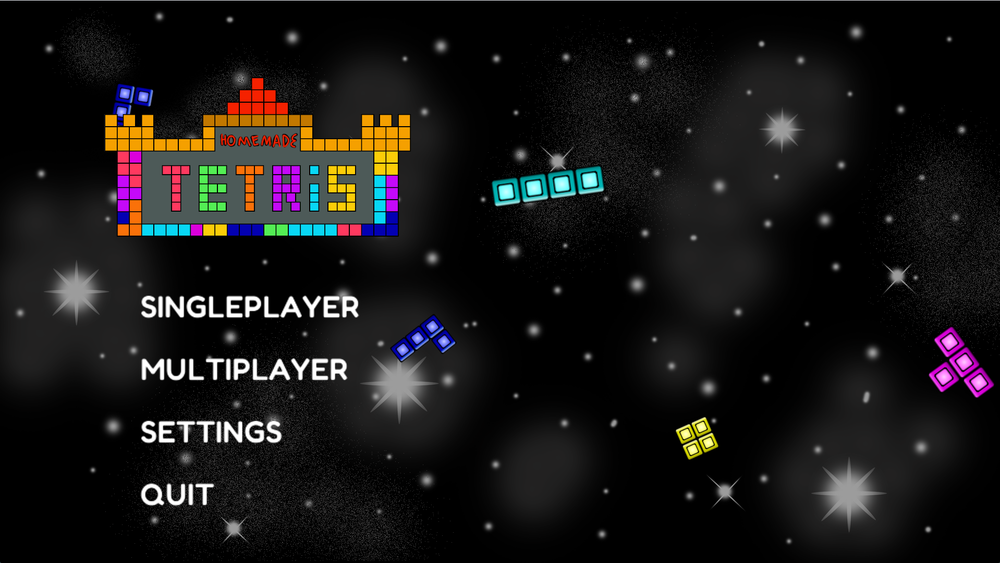
* Ở đây chúng tôi không có phần hướng dẫn như bạn thấy, vì tôi mặc định bạn đã biết chơi Tetris rồi. Thật đấy, giờ này ai không biết xếp mấy viên gạch vào đúng chỗ cơ chứ! :P Đùa thôi, nếu bạn không biết thì tôi có hướng dẫn ở phần sau.
* Game có 2 chế độ chơi chính: Chơi đơn (Singleplayer) và chơi nhiều người (Multiplayer).
# 2. Chơi đơn
Tựa game cung cấp cho bạn 5 chế độ chơi đơn như hình dưới đây:
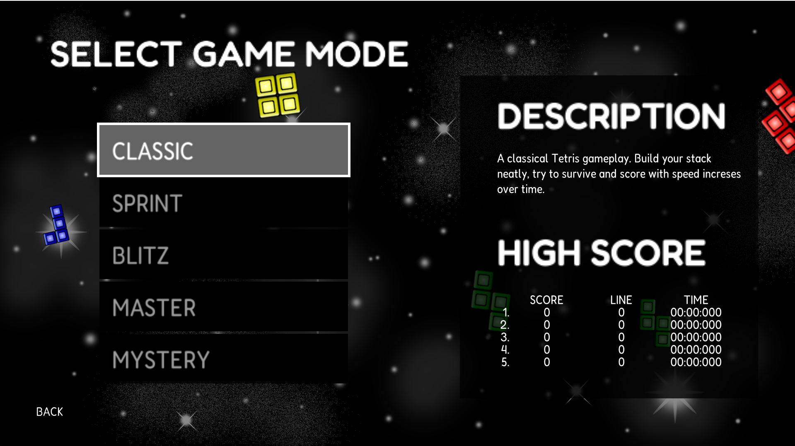
Mỗi chế độ chơi sẽ có mục tiêu và thiết lập khác nhau. Cụ thể:
* Classic: Chế độ chơi cơ bản nhất của dòng game Tetris. Nhiệm vụ của bạn là sắp xếp các khối gạch rơi từ trên cao xuống sao cho tạo ra các hàng hoàn chỉnh. Những hàng này sẽ biến mất sau đó, và hạ độ cao của chồng gạch xuống. Cố gắng dọn dẹp bàn chơi cẩn thận, tránh để chồng gạch đạt đến đỉnh và bạn sẽ thua cuộc. Lưu ý rằng tốc độ sẽ ngày càng tăng khi bạn xếp được càng nhiều hàng. 
* Sprint: Đúng như tên gọi, chế độ nước rút yêu cầu bạn hoàn thành mục tiêu đề ra trước đó trong thời gian ngắn nhất có thể.
* Blitz: Chớp nhoáng! Cố gắng ghi được nhiều điểm nhất có thể trong thử thách giới hạn thời gian này.
* Master: Chế độ yêu cầu sự quan sát, phản xạ và đưa ra quyết định ở tốc độ cực cao khi tốc độ gạch rơi được đẩy lên tối đa và thời gian gạch khóa vào vị trí sẽ giảm dần theo cấp độ. Nếu ai chưa biết thì Tetris hiện đại có cơ chế giữ miếng gạch ở trạng thái tự do trong một khoảng thời gian nhất định dù có vẻ nó đã chạm đất. Điều này giúp chế độ như Master hay Classic ở cấp độ cao trở nên khả thi hơn.
* Mystery: Chế độ chơi thuần giải trí không kém phần hấp dẫn so với các chế độ khác. Lối chơi tương tự như chế độ Classic tuy nhiên bạn sẽ gặp phải những sự kiện ngẫu nhiên vô cùng thú vị trong suốt hành trình. Có tất cả 7 loại sự kiện có thể xảy ra. Dưới đây là một vài minh họa:
  * Đôi khi chồng gạch của bạn quá cao và bạn muốn giải quyết nó nhanh chóng. Đừng lo đã có các khối bất ổn đây rồi. Ngoài ra còn có bom nữa.
  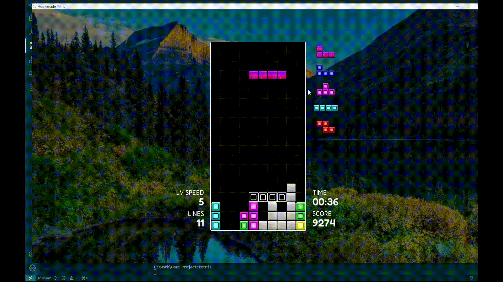
  * Tuy nhiên không phải lúc nào cũng may mắn vậy. Đôi khi game sẽ ném cho bạn một viên gạch to chà bá này thì sao nhỉ.
  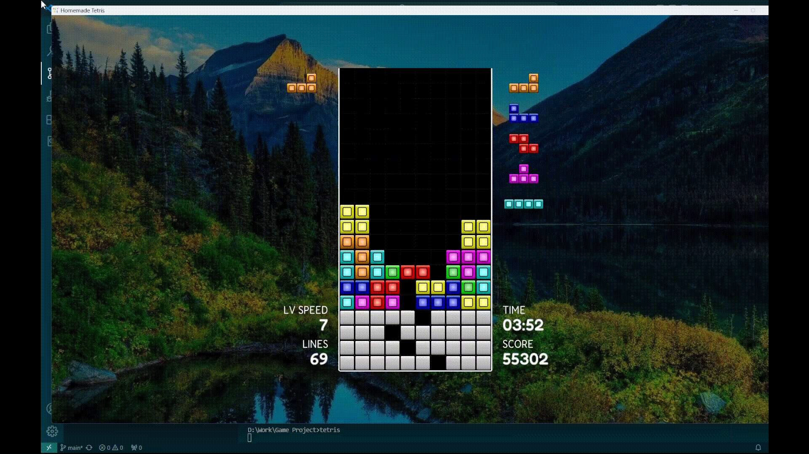
  * ... Hay thậm chí xoay ngược màn hình của bạn lại. :D
  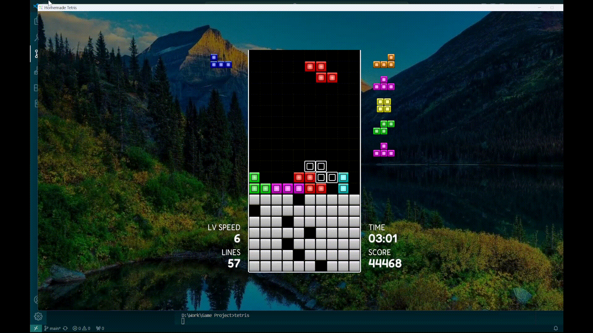
Để chơi, bạn bấm vào chế độ mà bạn mong muốn ở bên trái. Khi di chuột đến một chế độ, sẽ có một chút thông tin hiện ra ở bảng bên phải bao gồm mô tả game và bảng xếp hạng.
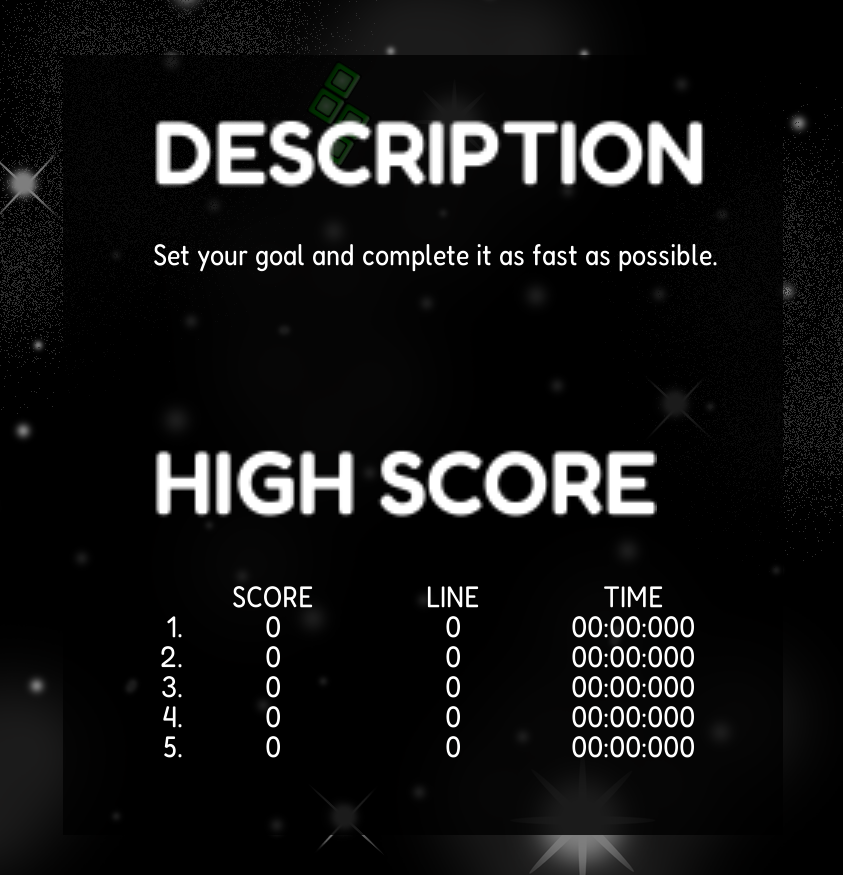
Sau khi chọn chế độ, sẽ có một bảng hiện ra cho phép bạn tùy chỉnh thiết lập ban đầu. Chọn theo ý muốn của bạn rồi nhấn "Start" để bắt đầu chơi thôi.
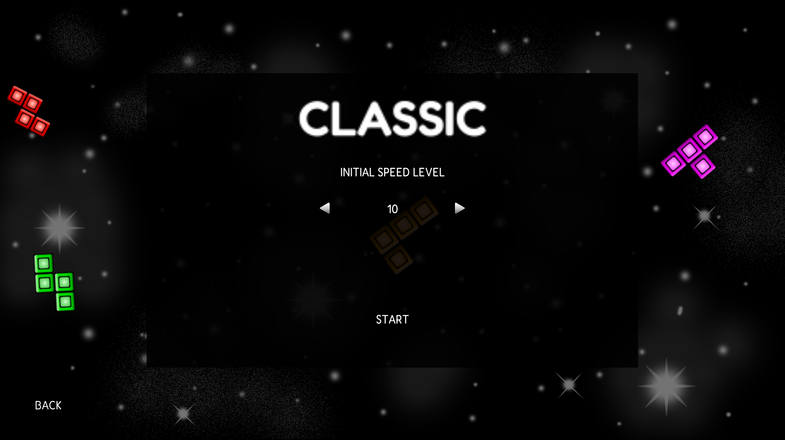
Khu vực chơi khá đơn giản, bao gồm một vài nền thiên nhiên ngẫu nhiên giúp bạn thư giãn, một bảng chơi, phía bên trên cạnh trái có hiển thị những viên gạch được bạn giữ lại, bên phải là các khối gạch xuất hiện tiếp theo. Bên dưới bảng chơi là một số thông số quan trong.
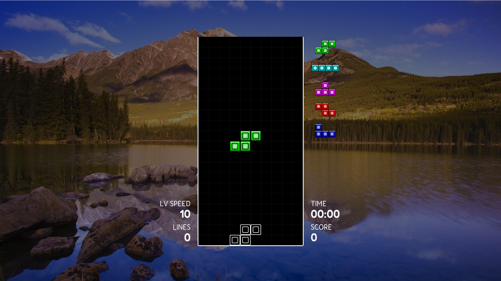
Trong quá trình chơi, bạn có thể bấm phím "Esc" để tạm dừng. Bảng tạm dừng hiện ra cung cấp cho bạn một vài tùy chọn nhỏ như "Tiếp tục", "Chơi lại", "Cài đặt", hoặc "Quay về màn hình chính".
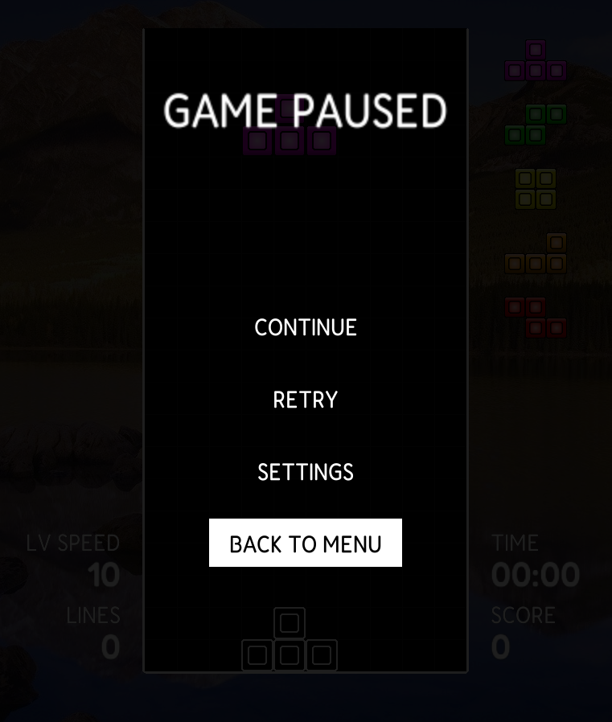
# 3. Chơi nhiều người (đang phát triển)
Để chơi nhiều người, bạn bấm vào tùy chọn "Multiplayer" bên ngoài màn hình chính.
Nếu chưa đặt tên, game sẽ yêu cầu bạn nhập một cái tên bất kì (không quá 16 kí tự). Sau khi nhập xong, bạn bấm set để lưu lại.
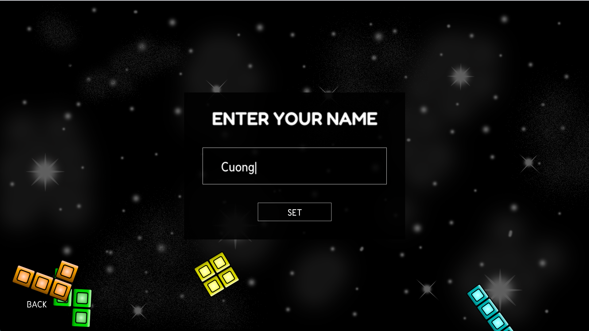
Giao diện menu nhiều người chơi có các tùy chọn: Tạo phòng chơi mới, tham gia phòng chơi có sẵn, hoặc đổi tên. Để chơi được chế độ này thì các máy tính phải có cùng kết nối mạng LAN.
Nếu bạn chọn tạo phòng, một bảng cài đặt sẽ hiện ra cho phép bạn tùy chỉnh các thiết lập của phòng như tên, chế độ chơi, giới hạn người chơi,... Sau khi cài đặt xong, bấm "Create" để tạo phòng.
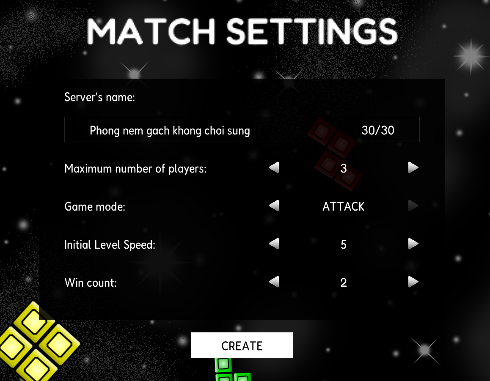
Nếu bạn chọn tham gia phòng có sẵn, một bảng danh sách các phòng sẽ hiện ra. Chọn một trong số các phòng đó, rồi bấm "Join" để vào phòng. Nếu không tìm thấy phòng bạn muốn, bấm "Refresh" để tiếp tục dò tìm phòng.
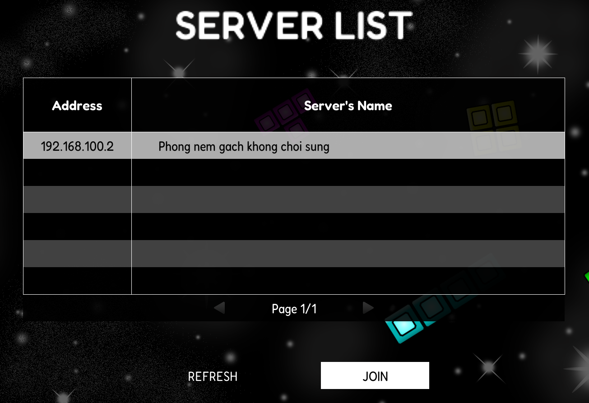
Trong phòng, bạn có thể thấy được bảng Info chứa thông tin phòng, cùng với bảng Player hiển thị danh sách người chơi trong phòng đó. Khi bạn đã sẵn sàng chơi, nhấn "READY" để báo với chủ phòng. Bạn có thể hủy sẵn sàng sau đó bằng cách bấm "CANCEL".
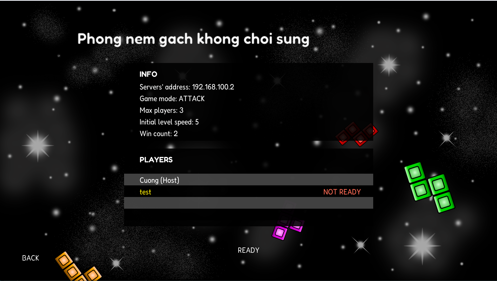
Đối với chủ phòng, bạn có thể bắt đầu trận đấu khi tất cả người chơi đã sẵn sàng, hoặc có thể đá người chơi khác ra khỏi phòng nếu không ưng. :P
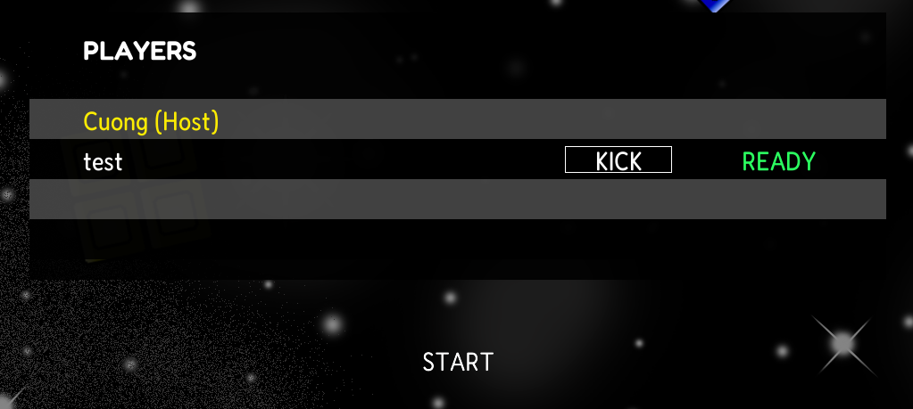
**LƯU Ý:** _Chế độ Multiplayer vẫn đang trong quá trình hoàn thiện nên chưa thế chơi được (Thực ra là có nếu bạn bỏ qua việc nó không thể kết thúc game, và có 1 số lỗi hoạt ảnh do hiệu ứng chưa hoàn thiện. Nó cung cấp cho những người chơi trong cùng 1 phòng một bộ gạch giống nhau đảm bảo sự công bằng. Tuy nhiên tốc độ gạch rơi luôn ở cấp độ 1 - rất chậm, nên xem chừng so găng ở đây không được hợp lý cho lắm.)_
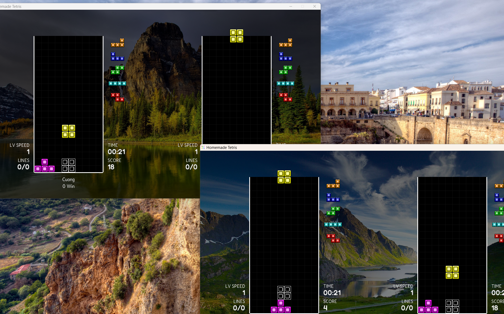
# 4. Cách chơi.
Ở mọi chế độ chơi, bạn sẽ điều khiển các viên gạch rơi sao cho chúng vừa khít vào các hàng, và tránh để chồng gạch chạm đỉnh. Những hàng gạch hoản chỉnh sẽ biến mất, và bạn nhận được một lượng điểm tùy theo độ khó hoặc Combo - chuỗi phá hàng liên tục.
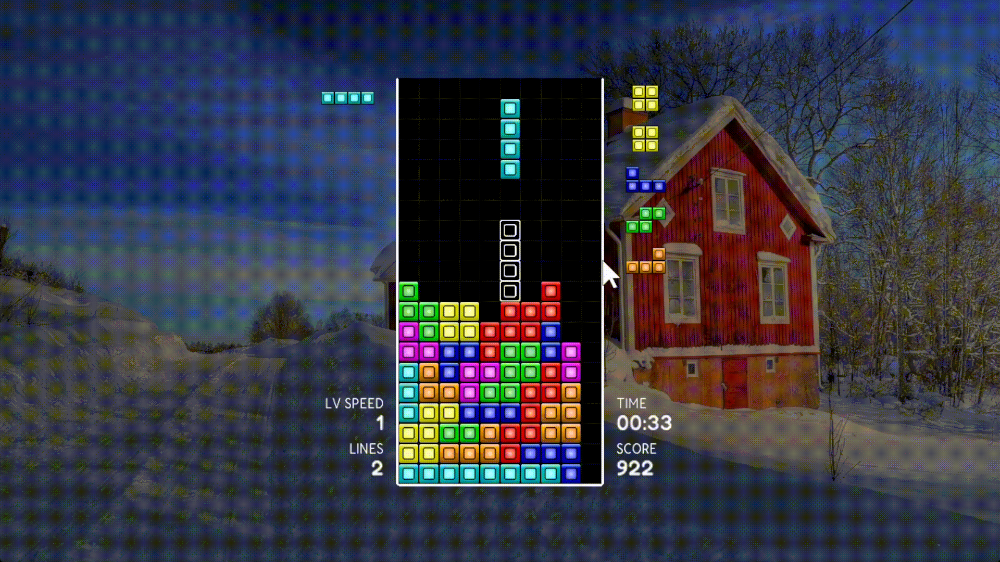
## Cách điều khiển
Mặc định, bạn sẽ sử dụng các phím mũi tên để điều khiển gạch: Phím sang trái/phải để điều khiển gạch di chuyển theo chiều ngang, phím lên để xoay gạch theo chiều kim đồng hồ, phím xuống để làm gạch rơi nhanh hơn. Tuy nhiên có một vài phìm mới mà có thể bạn không biết:
* Phím cách: thả rơi gạch khiến chúng chạm đất ngay lập tức
* Z: Xoay khối ngược chiều kim đồng hồ.
* X: Xoay khối theo chiều kim đồng hồl
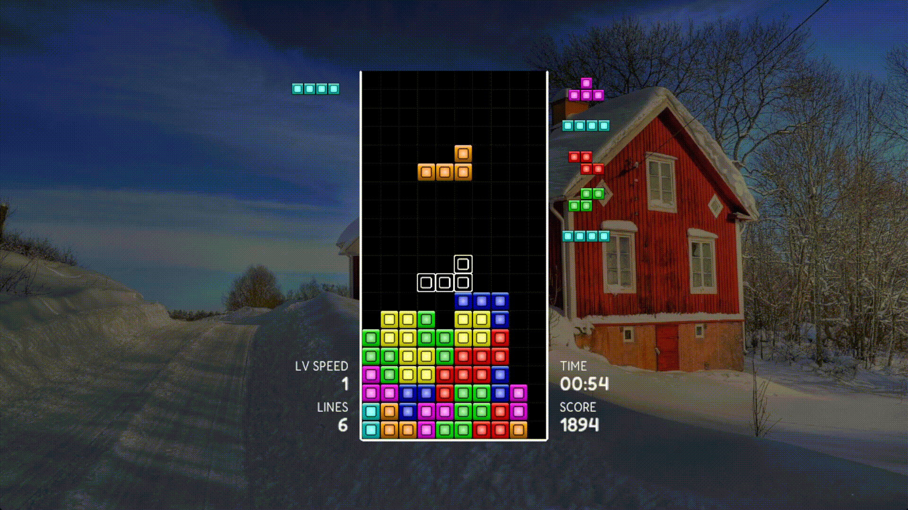
* C: Giữ một khối. Trong Tetris hiện đại, bạn sẽ có khả năng giữ lại một khối đang chơi nếu nó không phù hợp với chồng gạch hiện tại, hoặc muốn giữ lại cho tương lai. Tuy nhiên nếu bạn đã giữ một khối thì khi giữ một khối khác, khối đang giữ sẽ đổi chỗ cho khối này. Bạn cũng không được phép liên tục đổi khối giữ khi đã ra một lệnh giữ khối. Để tiếp tục giữ khối khác sau khi đã giữ một khối thì cần phải xếp ít nhất 1 khối vào chồng gạch.
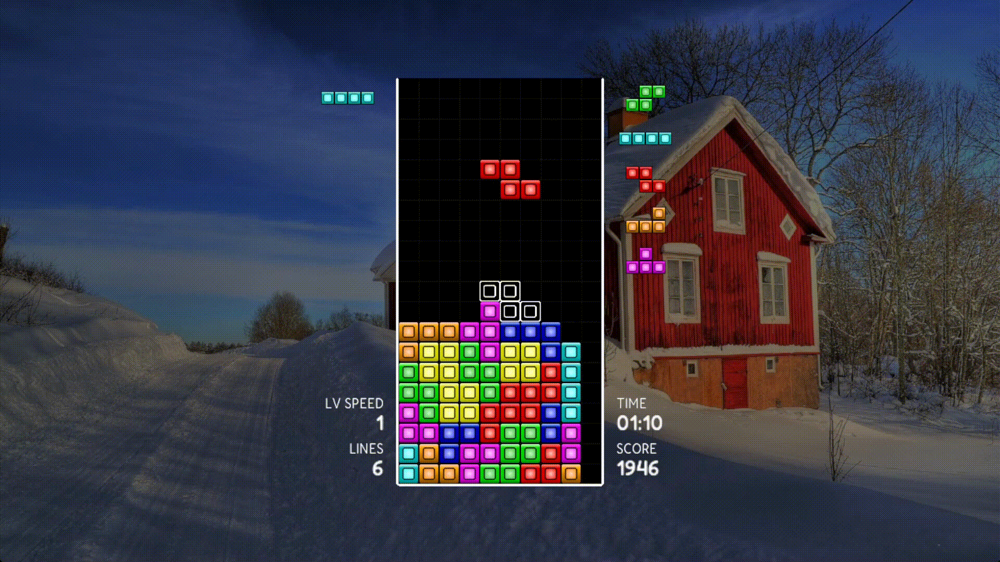
Bạn có thể sẽ cần phải ghi nhớ các chức năng này để tận dụng nó trong game, tuy nhiên không cần phải nhớ phím đâu nhé, vì bạn có thể thay đổi việc gán phím trong phần cài đặt sao cho thuận tiện nhất.
## Hoàn thành ván chơi

Một vài chế độ sẽ có mục tiêu để bạn chinh phục, trong khi đó các chế độ khác kéo dài vô tận và đi được đến đâu tùy thuộc vào khả năng của bạn.
Khi phần chơi kết thúc, màn hình sẽ hiện ra như sau.
# 5. Bảng cài đặt
Cài đặt gồm 2 phần chính: "Cài đặt chung" và "Điều khiển"
Mục cài đặt chung cho phép bạn tùy chỉnh một số thiết lập của game: Âm lượng, kích cỡ cửa sổ,...
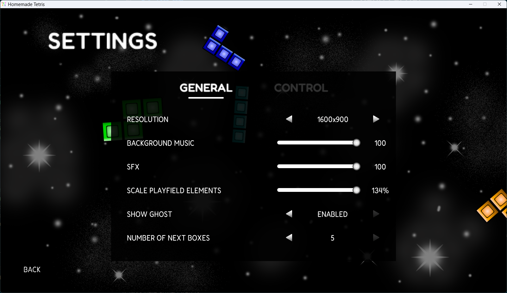
Mục điều khiển cho phép bạn tùy chỉnh gán các phím bấm cho các chức năng game. Mỗi chức năng cho phép bạn gán tối đa 2 phím. Để đổi phím gán, bấm vào tên của phím tại mục tương ứng.
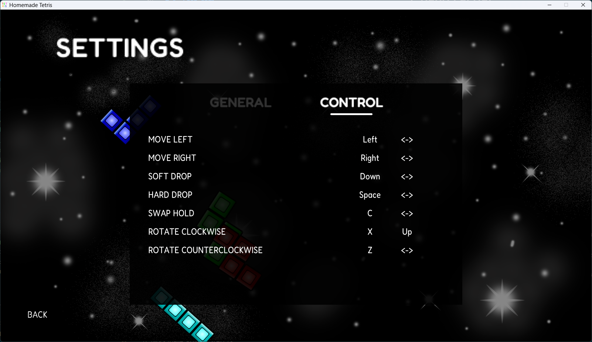
Một bảng yêu cầu hiện ra, bạn nhấn một phím để gán cho nó chức năng, hoặc bấm chuột để hủy gán phím. Mục chưa có phím nào gán sẽ hiển thị là <->.
# 6. Về mã nguồn.
* File PlayBoard, Tetromino chứa các thành phần của khu vực chơi: bảng chơi và khối gạch
* File Player chứa thông tin đủ cho một người chơi, bao gồm 1 bảng chơi, các khối hiện tại và khối giữ, cũng như thông tin về thông số như điểm, trạng thái phím bấm, các mốc thời gian quan trọng, các phương thức để điều khiển gạch hoặc hiển thị bảng chơi lên màn hình.
* File Texture lưu thông tin của class Texture dùng để render hình ảnh.
* File renderer gồm các hàm và phương thức render các phần tử hoặc giao diện.
* File logic chủ yếu xử lí logic của trò chơi: định hướng các lựa chọn, menu, hay điều khiển các sự kiện trong quá trình chơi.
* File settings, audio, onlan: phụ trách về phần thiết lập chương trình, phát âm thanh và xử lí kết nối mạng LAN.
* Folder src: chứa File media hoặc file lưu trữ cài đăt/bảng xếp hạng
* File main.cpp: Khởi tạo SDL, load media và chứa hàm main của trò chơi.
